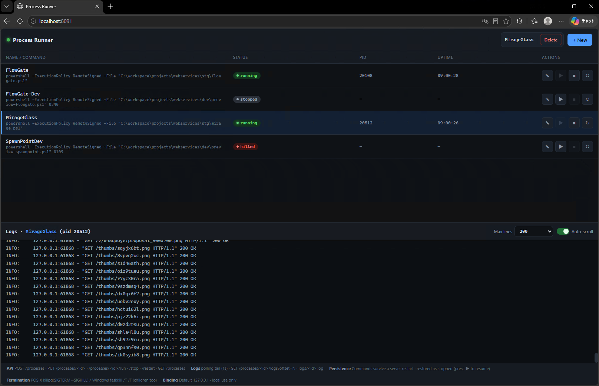

# SpawnPoint

SpawnPoint is a lightweight service for creating uniquely identified task instances and managing local subprocesses from a browser. The API, Runner UI, and process manager run together in one Python process on one port.



## Features

- Validates spawn requests and allocates collision-resistant instance IDs.
- Deduplicates repeated requests within a configurable time window.
- Persists spawn records and Runner commands in SQLite.
- Starts, stops, restarts, updates, and deletes OS subprocess registrations.
- Streams combined process output through a polling log API.
- Serves the Runner UI and JSON API from the same HTTP server.
- Supports optional Bearer-token authentication.

## Quick start

SpawnPoint requires Python and the dependencies listed in `requirements.txt`.

```bash
pip install -r requirements.txt
python -m app.main
```

The server starts on `http://127.0.0.1:8091` by default:

- Runner UI: `GET /`
- Health check: `GET /healthz`
- Spawn API: `POST /spawn`
- Process API: `/processes*`

Authentication is disabled when `SPAWNPOINT_API_TOKENS` is unset. For a token-protected deployment:

```bash
SPAWNPOINT_API_TOKENS="tok-a,tok-b" \
SPAWNPOINT_DB_PATH=/var/lib/spawnpoint.db \
python -m app.main
```

### Configuration

| Variable | Default | Description |
| --- | --- | --- |
| `SPAWNPOINT_HOST` | `127.0.0.1` | HTTP bind address |
| `SPAWNPOINT_PORT` | `8091` | HTTP port |
| `SPAWNPOINT_DB_PATH` | `spawnpoint.db` | SQLite database path |
| `SPAWNPOINT_LOG_DIR` | `logs` | Runner process log directory |
| `SPAWNPOINT_API_TOKENS` | unset | Comma-separated allowed Bearer tokens; auth is disabled when unset |
| `SPAWNPOINT_KILL_CHILDREN_ON_EXIT` | `1` | Set to `0` to leave Runner processes alive when the server exits |

Starting another server on an occupied port fails immediately with exit code 1 and an explanatory message.

## Spawn API

`POST /spawn` accepts JSON. When authentication is enabled, include `Authorization: Bearer <token>`.

```json
{
  "requester": "user-a1b2c3",
  "kind": "session",
  "request_key": "req-7f3a90",
  "options": {
    "label": "nightly-build",
    "ttl_seconds": 3600
  }
}
```

A successful response contains the allocated instance:

```json
{
  "ok": true,
  "instance": {
    "id": "spwn_20260725_0001a7c3f0",
    "status": "created",
    "kind": "session",
    "requester": "user-a1b2c3",
    "created_at": "2026-07-25T13:40:12+09:00"
  }
}
```

Instance IDs use `spwn_{YYYYMMDD}_{seq}{rand}`: a daily atomic sequence, zero-padded to four digits, followed by a six-digit hexadecimal suffix. The sequence and database primary key provide the uniqueness guarantees; collisions are retried.

Repeated `request_key` values received within the 300-second deduplication window return the existing instance with `"deduplicated": true`.

### Error responses

| Condition | HTTP status | Error code |
| --- | ---: | --- |
| Invalid request | 400 | `invalid_request` |
| Missing or invalid token | 401 | `unauthorized` |
| Request body over 64 KiB | 413 | `payload_too_large` |
| Storage failure | 500 | `storage_error` |
| Unknown route | 404 | `not_found` |
| Unsupported method | 405 | `method_not_allowed` |

Errors use this shape:

```json
{
  "ok": false,
  "error": {
    "code": "invalid_request",
    "field": "requester",
    "message": "..."
  }
}
```

## Process Runner

The dashboard uses the `/processes*` routes to manage real OS subprocesses. These routes follow the same authentication policy as `/spawn`.

| Method | Route | Purpose |
| --- | --- | --- |
| `GET` | `/processes` | List registered processes and their current state |
| `POST` | `/processes` | Register and start a process |
| `PUT` | `/processes/<id>` | Update a registration and start it |
| `DELETE` | `/processes/<id>` | Delete a registration |
| `POST` | `/processes/<id>/run` | Run a stopped registration |
| `POST` | `/processes/<id>/stop` | Stop the process tree |
| `POST` | `/processes/<id>/restart` | Restart the process with the same ID |
| `GET` | `/processes/<id>/logs?offset=<bytes>` | Read log output from a byte offset |

Start a process with a JSON body such as:

```json
{
  "cmd": "python worker.py",
  "label": "worker",
  "cwd": "/srv/app",
  "env": {
    "MODE": "development"
  }
}
```

Only `cmd` is required. When `label` is omitted, SpawnPoint uses the first token of the command. Commands run with `shell=True`, and combined stdout and stderr are appended to `logs/<id>.log`. The UI polls logs once per second.

Process-tree termination is platform-aware: POSIX uses process-group signals, while Windows uses `taskkill /T /F`. On Windows, child processes are also assigned to a job object with `KILL_ON_JOB_CLOSE` so the default cleanup policy still applies after a hard server shutdown.

### Persistence and restart behavior

Runner registrations (`id`, `label`, `cmd`, `cwd`, and `env`) are stored in the same SQLite database as spawn data and reloaded on startup. Log files remain readable because they are keyed by registration ID.

Live process state is intentionally not restored. A saved PID may have been reused by the operating system, so reloaded entries start as `stopped` with `pid: null`. Use `POST /processes/<id>/run` or the dashboard Run button to start them again.

By default, SpawnPoint terminates Runner children when the server exits. Setting `SPAWNPOINT_KILL_CHILDREN_ON_EXIT=0` leaves them running, but a restarted server cannot control those old processes because it restores registrations rather than unsafe PID ownership assumptions.

## Architecture

The spawn request pipeline is:

```text
Intake → Validator → Allocator → Registrar → Responder
```

```text
app/
  main.py                     Application entry point and server wiring
runnerview/
  page.py                     Static screen loader
  static/index.html           Runner UI
spawnpoint/
  allocator.py                Instance ID allocation
  auth.py                     Bearer-token validation
  clock.py                    KST display and UTC storage utilities
  http_api.py                 HTTP adapter and route handlers
  models.py                   Spawn instance model
  params.py                   Request parameters
  results.py                  Response builders
  runner.py                   Subprocess lifecycle management
  service.py                  Top-level spawn handler
  storage.py                  SQLite-backed registry
  validator.py                Request validation
  sql/                        sqloader queries and migrations
tests/                        Unit and socket-level integration tests
cmd/spawnpoint/               Go rewrite: server executable (see below)
sqlassets.go                  Go rewrite: embeds spawnpoint/sql into the executable
internal/config/              Go rewrite: environment-variable settings
internal/opslog/              Go rewrite: operations log
internal/lifecycle/           Go rewrite: startup and shutdown sequences
internal/host/                Go rewrite: service / console mode
internal/jobs/                Go rewrite: process containment groups
internal/runner/              Go rewrite: shell command line, child processes, cleanup, child logs
internal/textdec/             Go rewrite: child log decoding (UTF-8 / system code page / CP949)
internal/timefmt/             Go rewrite: response and storage timestamps
internal/sqlsplit/            Go rewrite: migration statement splitting
internal/dialect/             Go rewrite: dialect selector, query loader, error interpreter
internal/store/               Go rewrite: database access and migration runner
internal/httpapi/             Go rewrite: request front end — routes, authentication, responses
internal/webui/               Go rewrite: the dashboard, embedded in the executable
tools/pyref/                  Go rewrite: reference capture from the Python implementation
tools/exitprobe/              Go rewrite: exit-path measurement harness (not shipped)
```

`app/main.py` loads the static dashboard from `runnerview` and injects it into the HTTP adapter. The Runner and spawn registration domains share a server and database but remain separate in their service logic.

## Testing

Run the full test suite with:

```bash
python -m unittest discover -s tests -v
```

The storage layer uses the SQLite backend from `sqloader==0.2.18`; the remaining application modules use the Python standard library.

## Go server (single executable)

`cmd/spawnpoint` is the complete Go server: instance issuing, the process
runner, dashboard, SQL queries and migrations all ship in one executable. The
Python tree remains as the compatibility reference and test oracle; it is not a
runtime dependency of the Go deployment.

Build the production artifact with cgo disabled. `go:embed` includes the SQL and
dashboard, so `dist/spawnpoint.exe` is the only executable runtime artifact:

```powershell
$env:CGO_ENABLED = '0'
go build -trimpath -o dist/spawnpoint.exe ./cmd/spawnpoint
```

The program has no command-line options. It detects whether the Windows service
control manager started it; otherwise it runs in console mode. For a local
console check:

```powershell
$env:SPAWNPOINT_PORT = '8099'
$env:SPAWNPOINT_DB_PATH = 'C:\ProgramData\SpawnPoint\spawnpoint.db'
$env:SPAWNPOINT_LOG_DIR = 'C:\ProgramData\SpawnPoint\logs'
.\dist\spawnpoint.exe
```

Startup resolves configuration, opens the operations log, migrates the existing
SQLite database, restores registered commands as stopped, binds the port and
serves the complete API. Exit codes are 0 for a normal stop, 1 for a retryable
start/runtime failure, and 2 for an unrecoverable configuration or embedded
asset defect.

### Windows service registration

Registration uses Windows' standard service tools; the executable intentionally
has no install/uninstall subcommands. Run the following in an elevated
PowerShell session after copying the executable to its final absolute path.
Use absolute database and log paths because Windows services do not inherit the
operator's working directory or user environment.

```powershell
$exe = 'C:\Program Files\SpawnPoint\spawnpoint.exe'
sc.exe create SpawnPoint binPath= "`"$exe`"" start= auto DisplayName= "SpawnPoint"

$serviceKey = 'HKLM:\SYSTEM\CurrentControlSet\Services\SpawnPoint'
$serviceEnvironment = @(
  'SPAWNPOINT_HOST=0.0.0.0'
  'SPAWNPOINT_PORT=8091'
  'SPAWNPOINT_DB_PATH=C:\ProgramData\SpawnPoint\spawnpoint.db'
  'SPAWNPOINT_LOG_DIR=C:\ProgramData\SpawnPoint\logs'
  'SPAWNPOINT_API_TOKENS='
  'SPAWNPOINT_KILL_CHILDREN_ON_EXIT=1'
)
New-ItemProperty -Path $serviceKey -Name Environment -PropertyType MultiString `
  -Value $serviceEnvironment -Force

sc.exe failure SpawnPoint reset= 86400 `
  actions= restart/5000/restart/10000/restart/30000
sc.exe failureflag SpawnPoint 1
sc.exe start SpawnPoint
```

The final recovery action repeats after the third failure. SpawnPoint reports
exit 2 to the service manager as a clean stop, so an unrecoverable defect does
not enter that retry loop; exit 1 and other abnormal exits trigger the configured
5 s, 10 s, then 30 s recovery sequence. The process exit and operations log
still retain the original code.

To unregister, stop first and then delete only the service registration. The
database and logs are deliberately retained:

```powershell
sc.exe stop SpawnPoint
sc.exe delete SpawnPoint
```

### Shell command-line assembly

Registered commands reach the OS shell with nested, unescaped double quotes;
Go's `os/exec` would re-quote them and every registered command would fail to
launch. `internal/runner` therefore hands `syscall.SysProcAttr.CmdLine` a
finished string instead of an argument vector.

The contract is pinned against `internal/runner/testdata/python_reference.json`,
which is captured from the Python implementation — it intercepts CreateProcess
and records the real command line without starting anything:

```bash
python tools/pyref/dump_command_lines.py > internal/runner/testdata/python_reference.json
```

The operations log is `<SPAWNPOINT_LOG_DIR>/spawnpoint.log`, rotated at 16 MiB
with five archives kept. `stopping` is written before cleanup starts, so the
reason survives even when the operating system cuts shutdown short.
### Database

The Go server opens the *same* SQLite file as the Python implementation and
shares its migration history, so either can be started against a deployed
database without the other's work being undone. Three rules make that hold, and
each is covered by a test:

- the history lives in the existing `migrations` table and stores bare
  filenames, never paths, so already-applied scripts are recognised;
- `applied_at` is left to the column default rather than written, so new rows
  match the notation of old ones;
- a script's statements and its history row share one transaction, closing the
  window where the schema had changed but nothing recorded it.

The queries and migration scripts are not copied into the Go tree. `sqlassets.go`
embeds `spawnpoint/sql` directly — the files both implementations use are the
same files, which is the only arrangement in which they cannot drift.

`internal/dialect` bundles what has to change together when the engine does: the
driver, the query loader and the error interpreter. The interpreter replaces the
current implementation's search for words like `unique` in the driver's message,
which stops matching on any other engine and silently disables the
duplicate-request path with it; it reads the engine's numeric result code
instead.

The schema the Go migration runner produces is compared against one captured
from the Python implementation:

```bash
python tools/pyref/dump_schema.py > internal/store/testdata/python_schema.json
```

### Child processes and cleanup

A registered command is a shell line, so a child is never one process. Two
containment layers keep track of the tree (`internal/jobs`):

- a **server group** holding every child, with the property that the kernel
  kills its members when the last handle to it closes. It is released as the
  very last step of shutdown, so it covers the exit paths on which the server
  runs no code at all — killed from the task manager, killed for overrunning a
  shutdown budget, killed by a bug.
- a **child group** per child, so one stop request tears down that child and its
  descendants together instead of killing a shell and orphaning what it started.

A child is assigned to the server group **first** and to its own group second.
Windows makes the second job assigned the child of the first, so this is the
order that puts the server group on the outside; assigning the child group first
contains the first child and then has every later assignment refused. That is
measured, and pinned by `TestLiveAssignmentOrder`.

Child output is read through a pipe the server owns rather than by handing the
child the log file, which is what makes the file the server's to manage. The
collector is torn down only after the child is confirmed gone, so whatever the
child wrote on its way down is kept.

### Child logs: rotation, reading, notations

A child log rotates at 32 MiB and keeps three archives (`<id>.log.1` to `.3`),
which bounds one entry at 128 MiB. Rotation happens before the chunk that would
cross the threshold, so a chunk is never split across two files, and the new file
opens with a header line naming the time and how much was archived. A rename that
cannot happen — on Windows, a log query holding the file open — costs nothing:
the collector reopens the same file and tries again on the next chunk.

Reading is incremental. `GET .../logs` with no `offset` starts 256 KiB from the
end and moves forward to a line boundary; the caller sends the `next_offset` it
was given back on the next poll. One response carries at most 1 MiB. An `offset`
past the end of the file means the file was rotated underneath the caller, and
the response says `reset` so the screen redraws instead of splicing a new file
onto an old one. An `offset` that cannot be read at all falls to the recent end,
not to zero — the current implementation falls to zero, which turns one malformed
parameter into a full read of a 20 MiB file.

Windows commands write in more than one notation, so a chunk is tried as UTF-8,
then as the machine's ANSI code page, then as CP949, and each notation is judged
over the whole chunk (`internal/textdec`). A character whose tail has not been
written yet is left for the next read rather than shown broken, and the response
reports which notation was used. `internal/textdec/testdata/python_reference.json`
pins the result against the current implementation:

```bash
python tools/pyref/dump_decode.py > internal/textdec/testdata/python_reference.json
```

### Request front end

`internal/httpapi` is everything between the socket and the runner. The order in
which a request is judged is part of the contract, not an implementation detail:

1. body length — over 64 KiB is refused without being read;
2. is the path defined? — an unknown one is 404 *before* authentication, so an
   unauthenticated caller is not told which paths exist;
3. is the method allowed on that path? — 405 if not;
4. authentication, for everything except `/`, `/index.html` and `/healthz`;
5. is the body JSON, and is it an object?;
6. the field checks, reporting only the first thing that is wrong.

Responses are JSON with HTML escaping switched off. Go escapes `<`, `>` and `&`
by default, and every registered command contains `>nul`; with the default left
on, a command would come back visibly different from the one that was registered.

Two 404s exist and the message is what tells them apart: `Process not found.` is
a real operation on an identifier that is not registered, and `Unknown endpoint.`
is a path that does not exist — including `/processes/<id>/pause`, because an
operation name that is not `run`, `stop` or `restart` is not a bad method, it is
a path nobody defined.

The dashboard is compiled in (`internal/webui`) and served on `/` and
`/index.html` with `Cache-Control: no-store`, so a cached copy cannot outlive an
upgrade and talk to a server it no longer matches. It is checked at startup
alongside the SQL assets: a build that lost it stops the process instead of
serving a blank page indefinitely.

`POST /spawn` is routed, authenticated, validated and issued by the Go server.
The issuer performs duplicate lookup, atomic daily-sequence allocation,
cryptographic random-tail generation, collision retry and persistence against
the same SQLite database as the runner.

### Tests

```bash
go test ./...                                        # no processes are started
SPAWNPOINT_LIVE_SPAWN=1 go test ./internal/runner/ ./internal/jobs/
SPAWNPOINT_LIVE_SHUTDOWN=1 go test ./cmd/spawnpoint/  # + build, run, stop the exe
SPAWNPOINT_LIVE_PYREF=1 go test ./internal/store/ ./internal/textdec/
```

The live shutdown tests build the executable, run it on a free port with its own
database and log directory, and stop it with a real console control event. They
never touch the running instance: stopping it takes down everything it manages.

`TestExitPath*` is the exit-path measurement: a server with two children running,
killed by an interrupt, by its console window being closed, and outright. It runs
against `tools/exitprobe`, which wires the same packages together and registers
its children from the environment; keeping it independent of the HTTP layer means
the exit-path measurement stays valid when that layer changes.

`TestLive*` in `cmd/spawnpoint` drives the request front end over a real socket
against the built executable: the dashboard, liveness, a registration that starts
a process, its log, the delete that removes both, every error response, and a
shutdown with a request still in flight.

`SPAWNPOINT_LIVE_PYREF` runs the Python implementation to build a database, then
points the Go migration runner at it and requires that nothing is applied. It is
the check that the rewrite will not re-migrate the deployed file on first start.
It also re-captures the log decoding reference and requires the stored one to
match, so the fixture cannot quietly go stale.

## Scope

SpawnPoint currently provides instance creation and Runner process management. Instance lifecycle transitions after `created`, retention policies, expired-record deletion, and alternative database engines remain outside the current scope.